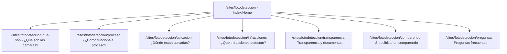
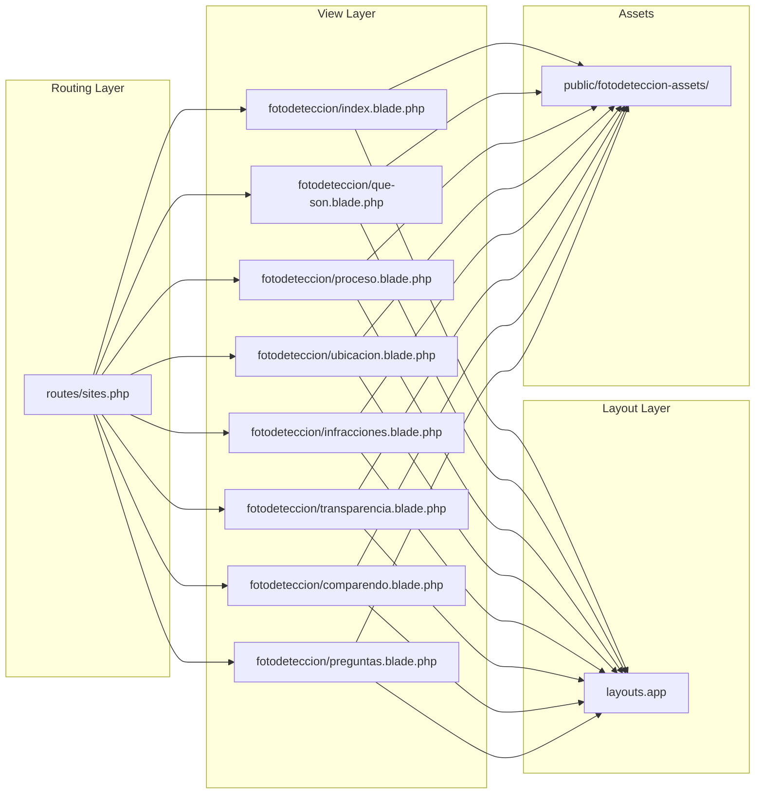

# Design Document: Landing Page - Cámaras de Fotodetección

## Overview

Sitio informativo multi-nodo sobre el sistema de cámaras de fotodetección en Bogotá, construido como un conjunto de Blade templates integrados al portal de la Secretaría Distrital de Movilidad. El sitio consta de un Index/Home como estación central de decisión y 7 nodos internos, cada uno dedicado a un tema específico del sistema de fotodetección.

El diseño sigue el patrón existente del portal (`cem.blade.php`): un archivo Blade por vista que extiende `layouts.app`, encapsula todo el contenido en un contenedor con ID único, aplica `all: initial` para aislamiento de estilos, e incluye CSS y JS inline.

### Decisiones de diseño clave

1. **Un archivo Blade por nodo**: Cada nodo es un archivo independiente en `resources/views/sites/`. Esto mantiene la consistencia con el patrón existente y facilita el mantenimiento.
2. **Aislamiento total de estilos**: Cada vista usa `#fotodeteccion` como contenedor raíz con `all: initial`, prefijando todos los selectores CSS con ese ID.
3. **JavaScript vanilla inline**: Sin dependencias externas. Cada componente interactivo (acordeón, filtro, timeline) se implementa con JS vanilla al final del contenedor.
4. **Assets centralizados**: Todas las imágenes e íconos en `public/fotodeteccion-assets/`.
5. **Rutas con `Route::view()`**: Sin controladores, siguiendo el patrón existente en `routes/sites.php`.

## Architecture

### Diagrama de estructura del sitio



### Diagrama de capas técnicas



### Estructura de archivos

```
resources/views/sites/fotodeteccion/
├── index.blade.php          # Index/Home - estación central
├── que-son.blade.php        # Nodo: ¿Qué son las cámaras?
├── proceso.blade.php        # Nodo: ¿Cómo funciona el proceso?
├── ubicacion.blade.php      # Nodo: ¿Dónde están ubicadas?
├── infracciones.blade.php   # Nodo: ¿Qué infracciones detectan?
├── transparencia.blade.php  # Nodo: Transparencia y documentos
├── comparendo.blade.php     # Nodo: Si recibiste un comparendo
└── preguntas.blade.php      # Nodo: Preguntas frecuentes

public/fotodeteccion-assets/
├── hero/                    # Imágenes del hero del Index
├── icons/                   # Íconos SVG inline o archivos
└── docs/                    # Documentos descargables (transparencia)

routes/sites.php             # Registro de rutas Route::view()
```

## Components and Interfaces

### 1. Contenedor raíz (`#fotodeteccion`)

Elemento `<div>` que encapsula todo el contenido del sitio en cada vista. Aplica el reset de estilos y define las variables CSS del sistema de diseño.

```html
<div id="fotodeteccion">
    <style>
        #fotodeteccion, #fotodeteccion *, #fotodeteccion *::before, #fotodeteccion *::after {
            box-sizing: border-box;
        }
        #fotodeteccion {
            all: initial;
            display: block;
            font-family: system-ui, -apple-system, sans-serif;
            color: var(--fd-text);
            line-height: 1.6;
            /* Variables del sistema de diseño */
            --fd-primary: #1a3a6b;
            --fd-secondary: #2c5aa0;
            --fd-accent: #e8a838;
            --fd-text: #1a1a2e;
            --fd-text-light: #4a4a5a;
            --fd-bg: #ffffff;
            --fd-bg-alt: #f5f7fa;
            --fd-border: #e2e8f0;
            --fd-success: #2d8a4e;
            --fd-radius: 8px;
            --fd-shadow: 0 2px 8px rgba(0,0,0,0.08);
            --fd-max-width: 1200px;
        }
    </style>
    <!-- Contenido de la vista -->
    <script>
        // JavaScript inline al final
    </script>
</div>
```

### 2. Componente Hero (Index)

Bloque visual principal con título, subtexto y dos CTAs. Solo aparece en el Index.

**Estructura HTML:**
```html
<section class="fd-hero" aria-labelledby="fd-hero-title">
    <div class="fd-hero__content">
        <h1 id="fd-hero-title" class="fd-hero__title">Cámaras de fotodetección en Bogotá</h1>
        <p class="fd-hero__subtitle"><!-- subtexto max 120 chars --></p>
        <div class="fd-hero__actions">
            <a href="/sites/fotodeteccion/comparendo" class="fd-btn fd-btn--primary">Consultar comparendo</a>
            <a href="/sites/fotodeteccion/proceso" class="fd-btn fd-btn--secondary">Conocer cómo funciona</a>
        </div>
    </div>
</section>
```

### 3. Componente Acordeón

Componente reutilizable para preguntas frecuentes (Index y Nodo Preguntas). Soporta dos modos:
- **Selección múltiple** (Nodo Preguntas): varias preguntas pueden estar expandidas simultáneamente.
- **Selección única** (Timeline del proceso): solo un elemento expandido a la vez.

**Estructura HTML:**
```html
<div class="fd-accordion" role="region" aria-labelledby="fd-accordion-title">
    <h2 id="fd-accordion-title">Preguntas frecuentes</h2>
    <div class="fd-accordion__item">
        <button class="fd-accordion__trigger"
                aria-expanded="false"
                aria-controls="fd-acc-1"
                id="fd-acc-btn-1">
            <span class="fd-accordion__title">¿Pregunta?</span>
            <span class="fd-accordion__icon" aria-hidden="true">+</span>
        </button>
        <div class="fd-accordion__panel"
             id="fd-acc-1"
             role="region"
             aria-labelledby="fd-acc-btn-1"
             hidden>
            <p>Respuesta...</p>
        </div>
    </div>
</div>
```

**Comportamiento JS:**
- Click en trigger: toggle `aria-expanded`, toggle `hidden` en panel
- Modo múltiple: cada item es independiente
- Modo único: al expandir uno, colapsa el anterior

### 4. Componente Filtro por Categoría

Usado en Nodo Infracciones y Nodo Transparencia. Implementa un patrón de tabs accesible.

**Estructura HTML:**
```html
<div class="fd-filter">
    <div class="fd-filter__tabs" role="tablist" aria-label="Categorías de infracciones">
        <button role="tab" aria-selected="true" aria-controls="fd-cat-1" id="fd-tab-1"
                class="fd-filter__tab fd-filter__tab--active">Automáticas</button>
        <button role="tab" aria-selected="false" aria-controls="fd-cat-2" id="fd-tab-2"
                class="fd-filter__tab" tabindex="-1">Semiautomáticas</button>
        <button role="tab" aria-selected="false" aria-controls="fd-cat-3" id="fd-tab-3"
                class="fd-filter__tab" tabindex="-1">Carril preferencial</button>
    </div>
    <div role="tabpanel" id="fd-cat-1" aria-labelledby="fd-tab-1" class="fd-filter__panel">
        <!-- Contenido de la categoría -->
    </div>
    <div role="tabpanel" id="fd-cat-2" aria-labelledby="fd-tab-2" class="fd-filter__panel" hidden>
        <!-- Contenido de la categoría -->
    </div>
</div>
```

**Comportamiento JS:**
- Click en tab: activa panel correspondiente, desactiva los demás
- Navegación por teclado: Arrow Left/Right entre tabs, Home/End para primero/último
- Gestión de `aria-selected` y `tabindex`

### 5. Componente Timeline (Nodo Proceso)

Timeline vertical interactivo con 6 pasos. Comportamiento de acordeón de selección única con animaciones de aparición.

**Estructura HTML:**
```html
<div class="fd-timeline" role="list" aria-label="Pasos del proceso de fotodetección">
    <div class="fd-timeline__step" role="listitem" aria-current="step">
        <div class="fd-timeline__marker">
            <span class="fd-timeline__number">1</span>
        </div>
        <div class="fd-timeline__content">
            <button class="fd-timeline__trigger"
                    aria-expanded="false"
                    aria-controls="fd-step-1">
                <h3 class="fd-timeline__title">Captura</h3>
            </button>
            <div class="fd-timeline__detail" id="fd-step-1" hidden>
                <p>Descripción del paso...</p>
            </div>
        </div>
    </div>
</div>
```

**Comportamiento JS:**
- Click en paso: expande ese paso, colapsa el anterior (selección única)
- IntersectionObserver: animación de aparición al entrar en viewport (max 400ms)
- Respeta `prefers-reduced-motion`: sin animaciones si está activo

### 6. Componente Biblioteca de Documentos (Nodo Transparencia)

Lista filtrable de documentos con categorías. Usa el mismo patrón de Filtro por Categoría pero con estado inicial "todos visibles".

**Estructura HTML:**
```html
<div class="fd-docs">
    <div class="fd-docs__filters" role="tablist" aria-label="Categorías de documentos">
        <button role="tab" aria-selected="true" class="fd-docs__filter fd-docs__filter--active">Todos</button>
        <button role="tab" aria-selected="false" class="fd-docs__filter" tabindex="-1">Normativa</button>
        <button role="tab" aria-selected="false" class="fd-docs__filter" tabindex="-1">Operación</button>
        <!-- más categorías -->
    </div>
    <div class="fd-docs__list" role="tabpanel">
        <article class="fd-docs__item" data-category="normativa">
            <h3 class="fd-docs__title">Título del documento</h3>
            <span class="fd-docs__category">Normativa</span>
            <a href="/fotodeteccion-assets/docs/archivo.pdf"
               class="fd-docs__download"
               target="_blank"
               rel="noopener noreferrer">
                Descargar
            </a>
        </article>
    </div>
</div>
```

### 7. Componente Opciones de Comparendo (Nodo Comparendo)

Lista de 5 opciones expandibles con descripción y enlace externo.

**Estructura HTML:**
```html
<div class="fd-options" role="region" aria-labelledby="fd-options-title">
    <h1 id="fd-options-title">¿Recibiste un comparendo?</h1>
    <div class="fd-options__list">
        <div class="fd-options__item">
            <button class="fd-options__trigger"
                    aria-expanded="false"
                    aria-controls="fd-opt-1">
                <span class="fd-options__name">Consultar comparendo</span>
                <span class="fd-options__entity">SIMIT</span>
            </button>
            <div class="fd-options__detail" id="fd-opt-1" hidden>
                <p>Descripción breve de la acción...</p>
                <a href="https://..." target="_blank" rel="noopener noreferrer"
                   class="fd-btn fd-btn--outline">Ir al trámite</a>
            </div>
        </div>
    </div>
</div>
```

### 8. Navegación interna del sitio

Cada nodo incluye un breadcrumb y enlace de retorno al Index para orientación del usuario.

```html
<nav class="fd-breadcrumb" aria-label="Ubicación en el sitio">
    <a href="/sites/fotodeteccion">Inicio</a>
    <span aria-hidden="true">›</span>
    <span aria-current="page">Nombre del nodo</span>
</nav>
```

## Data Models

Este sitio es completamente estático — no hay modelos de base de datos ni APIs. Todo el contenido está hardcodeado en los Blade templates.

### Estructura de datos del contenido (inline en Blade)

**Cifras de impacto (Index):**
```
- valor: "30%", etiqueta: "reducción de siniestros en corredores monitoreados"
- valor: "33%", etiqueta: "disminución de exceso de velocidad"
- valor: "27%", etiqueta: "menos infracciones de semáforo en rojo"
```

**Pasos del proceso (Nodo Proceso):**
```
1. Captura - La cámara registra la infracción
2. Carga a la plataforma - Se sube la evidencia al sistema
3. Consulta al RUNT - Se verifica la información del vehículo
4. Validación por agente - Un agente de tránsito revisa la evidencia
5. Firma del comparendo - Se genera y firma el comparendo electrónico
6. Notificación - Se notifica al propietario del vehículo
```

**Infracciones por categoría (Nodo Infracciones):**
```
Automáticas:
- Exceso de velocidad
- Semáforo en rojo o señal de PARE
- RTM vencida
- SOAT no vigente

Semiautomáticas:
- Mal parqueo
- Bloqueo de cruce peatonal
- Bloqueo de intersección
- Recoger o dejar pasajeros en zonas no permitidas

Carril preferencial y restricciones:
- Pico y Placa
- Carriles preferenciales o exclusivos sin autorización
```

**Categorías de documentos (Nodo Transparencia):**
```
- Normativa
- Operación
- Calibración
- Seguridad vial
- Estudios y reportes
```

**Opciones de comparendo (Nodo Comparendo):**
```
1. Consultar comparendo - SIMIT
2. Pagar - Secretaría Distrital de Movilidad
3. Hacer curso pedagógico - Secretaría Distrital de Movilidad
4. Impugnar - Secretaría Distrital de Movilidad
5. Entender por qué llegó el comparendo - Secretaría Distrital de Movilidad
```

**Preguntas frecuentes (Nodo Preguntas):**
```
Sobre velocidad:
- ¿Cuál es el margen de tolerancia?
- ¿Qué velocidades mide el radar?

Sobre precisión:
- ¿Cómo se calibran las cámaras?
- ¿Pueden leer todas las placas?
- ¿Detectan motocicletas?

Sobre el comparendo:
- ¿Qué hago si el comparendo es incorrecto?
- ¿Quién puede firmar un comparendo electrónico?
```

## Correctness Properties

*A property is a characteristic or behavior that should hold true across all valid executions of a system — essentially, a formal statement about what the system should do. Properties serve as the bridge between human-readable specifications and machine-verifiable correctness guarantees.*

### Property 1: Accordion toggle preserves content integrity

*For any* accordion component and any sequence of expand/collapse interactions, the visible content of an expanded panel SHALL always match the content defined in the HTML source for that panel, and collapsing then re-expanding a panel SHALL display identical content.

**Validates: Requirements 4.4, 9.7, 9.8**

### Property 2: Category filter shows only matching items

*For any* category selection in the Filtro_Categoría component, the set of visible items SHALL be exactly the set of items whose `data-category` attribute matches the selected category, with no items from other categories visible and no matching items hidden.

**Validates: Requirements 6.3, 7.3**

### Property 3: Accordion keyboard navigation reaches all interactive elements

*For any* page in the Landing_Site, sequential Tab key presses SHALL eventually reach every interactive element (buttons, links, accordion triggers, filter tabs) exactly once before cycling, and each focused element SHALL have a visible focus indicator.

**Validates: Requirements 10.2**

## Error Handling

### Recursos externos no disponibles

- **Nodo Ubicación**: Si el enlace externo de consulta de puntos no está configurado, el CTA se muestra con un mensaje "Recurso no disponible en este momento" y se deshabilita visualmente (sin `pointer-events`, opacidad reducida, `aria-disabled="true"`).
- **Nodo Comparendo**: Los enlaces a recursos externos (SIMIT, etc.) se abren en nueva pestaña. Si el recurso no carga, es responsabilidad del sitio externo.

### Imágenes que no cargan

- Todas las imágenes informativas tienen `alt` descriptivo como fallback textual.
- Las imágenes decorativas usan `alt=""` y `aria-hidden="true"`.
- Se usa `loading="lazy"` para imágenes fuera del viewport inicial.

### JavaScript deshabilitado

- El contenido base es HTML semántico y legible sin JS.
- Los acordeones muestran todo el contenido expandido por defecto (sin `hidden`) y el JS añade el comportamiento interactivo progresivamente.
- Los filtros muestran todas las categorías visibles sin JS.

### Categoría sin documentos

- Si una categoría de la Biblioteca de Documentos no tiene documentos, se muestra un mensaje: "No hay documentos disponibles en esta categoría."

## Testing Strategy

### Por qué no se aplica Property-Based Testing

Este feature es un sitio informativo estático construido con Blade templates, CSS inline y JavaScript vanilla para interacciones UI. No contiene:
- Funciones puras con comportamiento input/output testeable
- Transformaciones de datos o algoritmos
- Serialización/deserialización
- Lógica de negocio compleja

Los acceptance criteria se centran en layout visual, estructura HTML, comportamiento de componentes UI, accesibilidad y responsive design. Esto cae en la categoría de "UI rendering and layout" donde PBT no es apropiado.

### Estrategia de testing recomendada

#### 1. Tests de integración de rutas (PHPUnit)

Verificar que todas las rutas responden correctamente:

```php
// tests/Feature/FotodeteccionRoutesTest.php
public function test_index_returns_200() {
    $response = $this->get('/sites/fotodeteccion');
    $response->assertStatus(200);
    $response->assertSee('Cámaras de fotodetección en Bogotá');
}

public function test_all_nodes_return_200() {
    $nodes = ['que-son', 'proceso', 'ubicacion', 'infracciones',
              'transparencia', 'comparendo', 'preguntas'];
    foreach ($nodes as $node) {
        $response = $this->get("/sites/fotodeteccion/{$node}");
        $response->assertStatus(200);
    }
}
```

#### 2. Tests de accesibilidad (manual + herramientas)

- **axe-core** o **Lighthouse** para auditoría automatizada de WCAG 2.1 AA
- Verificación manual de navegación por teclado (Tab, Enter, Space, Arrow keys)
- Verificación de contraste con herramientas como WebAIM Contrast Checker
- Pruebas con lectores de pantalla (NVDA/VoiceOver) para validar ARIA

#### 3. Tests de estructura HTML (PHPUnit)

Verificar que cada vista contiene los elementos semánticos requeridos:

```php
public function test_index_has_required_structure() {
    $response = $this->get('/sites/fotodeteccion');
    $response->assertSee('id="fotodeteccion"', false);
    $response->assertSee('all: initial', false);
    $response->assertSee('role="region"', false);
}
```

#### 4. Tests de responsive design (manual)

- Verificar en breakpoints: 320px, 375px, 768px, 1024px, 1440px, 1920px
- Confirmar que no hay desbordamiento horizontal
- Confirmar áreas táctiles mínimas de 44×44px en móvil

#### 5. Tests de rendimiento

- Lighthouse Performance: LCP ≤ 2.5s en 4G
- Peso total de página inicial ≤ 1.5 MB
- Verificar lazy loading de imágenes fuera del viewport

#### 6. Tests de comportamiento JS (manual o E2E)

- Acordeón: expandir/colapsar funciona correctamente
- Filtro de categorías: muestra solo la categoría seleccionada
- Timeline: selección única, animaciones respetan `prefers-reduced-motion`
- Navegación por teclado en todos los componentes interactivos
